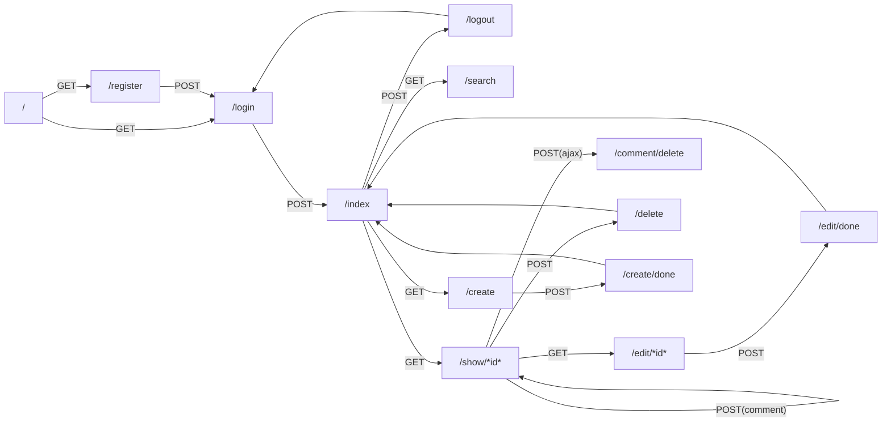

# 機能一覧

| URL            | Method| Description   |
| :--------------| :-----| :-------------|
| /login         | GET   | ログインフォーム |
| /login         | POST  | ログイン処理 |
| /logout        | POST  | ログアウト処理 |
| /register      | GET   | ユーザー登録フォーム |
| /register      | POST  | ユーザー登録 |
| /index         | GET   | ログインユーザーのTodo一覧表示 |
| /search        | GET   | 検索結果のTodo一覧表示 |
| /create        | GET   | Todo新規作成フォーム |
| /create/done   | POST  | Todo新規作成 |
| /edit/{id}     | GET   | Todo編集フォーム |
| /edit/done     | POST  | Todo更新 |
| /delete        | POST  | Todo削除 |
| /show/{id}     | GET   | Todo詳細とコメント一覧 |
| /show/{id}     | POST  | コメント投稿と更新 |
| /comment/delete| POST  | コメント削除(ajax) |

*{id}はTodoのid

# ページ遷移図

# その他ドキュメント
* [詰まったところ・分かったこと](docs/README.md)